# Material3 – a Material Design 3 theme for ruTorrent

A theme for [ruTorrent](https://github.com/Novik/ruTorrent) 5.x based on Google's Material Design 3. It comes in a light and a dark scheme and switches with the operating system setting automatically.

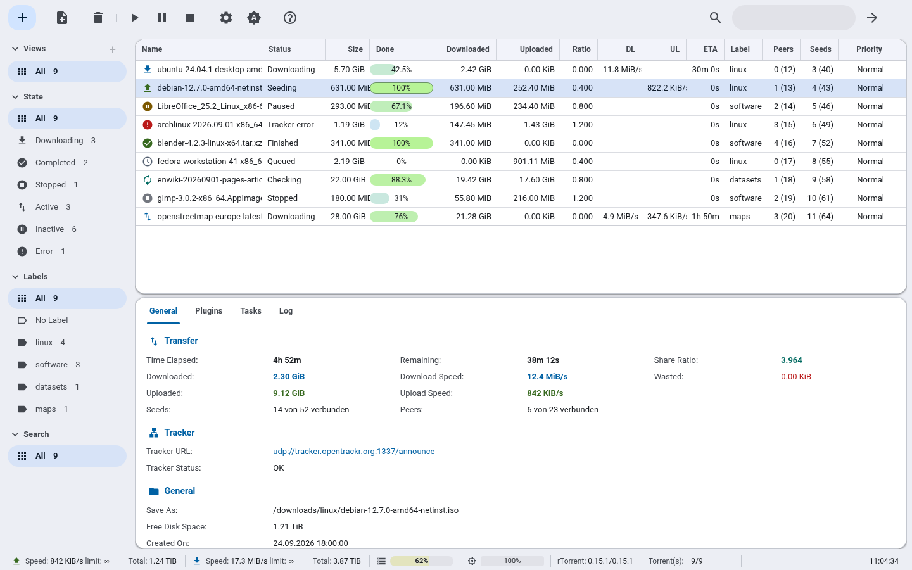

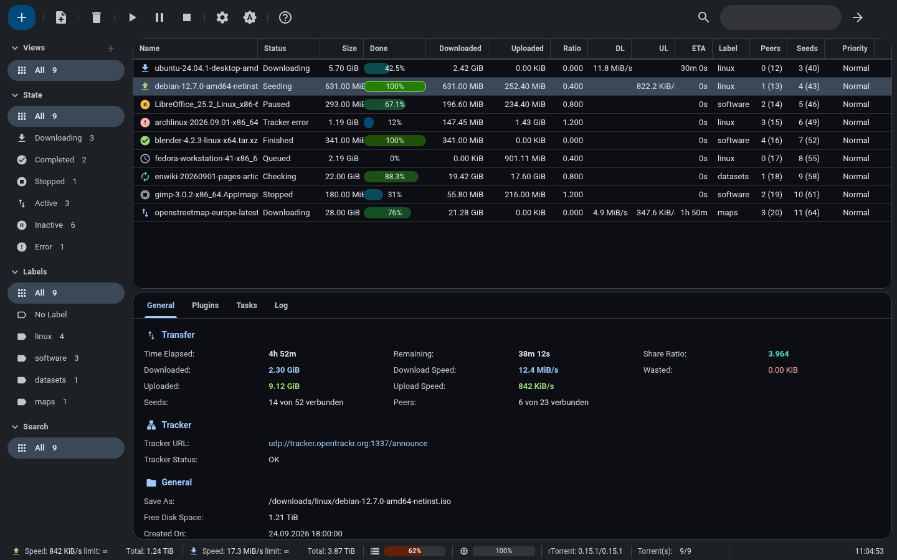

## Features

- **Light and dark scheme** built from Material 3 color tokens (blue seed `#0061A4`, neutral grey surfaces). By default the theme follows the system and switches live, without a reload. Users can also pick a scheme in the settings or with a toolbar button.
- **Material Icons** for the toolbar, sidebar, torrent states, dialogs and status bar. They are inline SVG masks, so every icon picks up the current color scheme.
- **Roboto** is bundled, so the theme needs no external requests.
- **Navigation-drawer sidebar** with rounded entries, counters and icons for states and labels.
- **Torrent list** with colored status icons, rounded progress bars, hover highlighting and a clearly marked selection.
- **Material dialogs**: large corner radius, elevation, filled and outlined buttons, outlined text fields. Plugin dialog headers get a matching icon.
- **General tab** with colored key values (download, upload, ratio, wasted) and section icons.
- **Plugin support** for diskspace, cpuload, check_port, _getdir, _task, rss, rssurlrewrite, extratio, chunks and _noty. Notifications appear as Material snackbars.
- **Mobile layout** from ruTorrent 5.x, including the collapsible top menu.

## Screenshots

| Light | Dark |
|---|---|
| 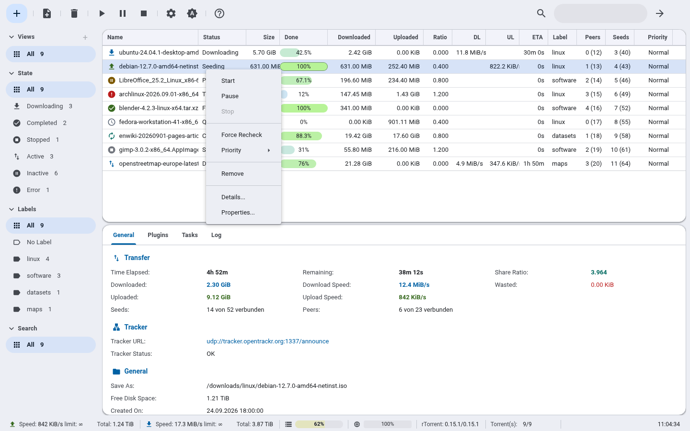 | 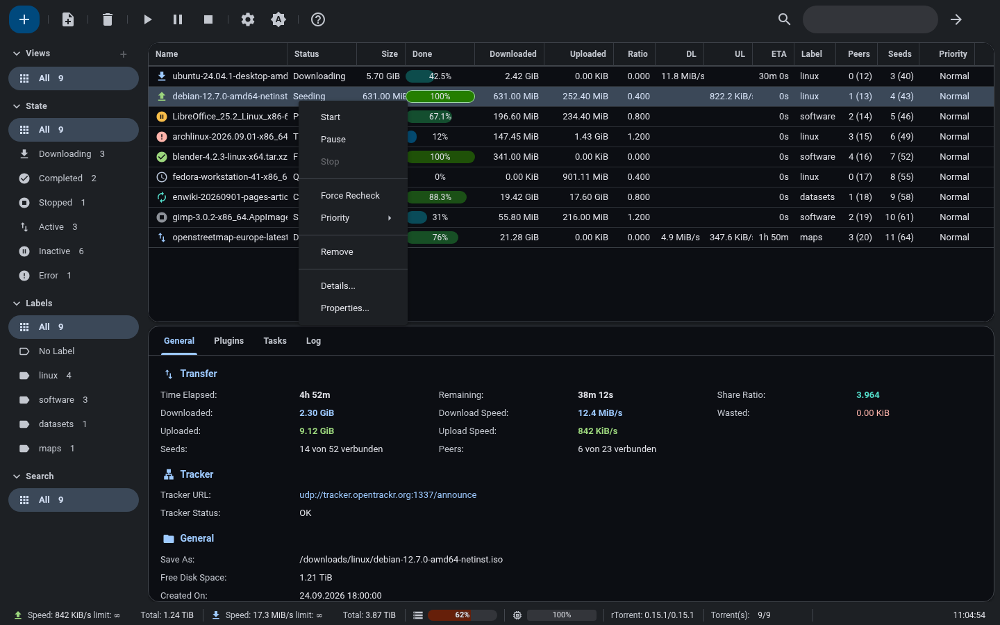 |
| 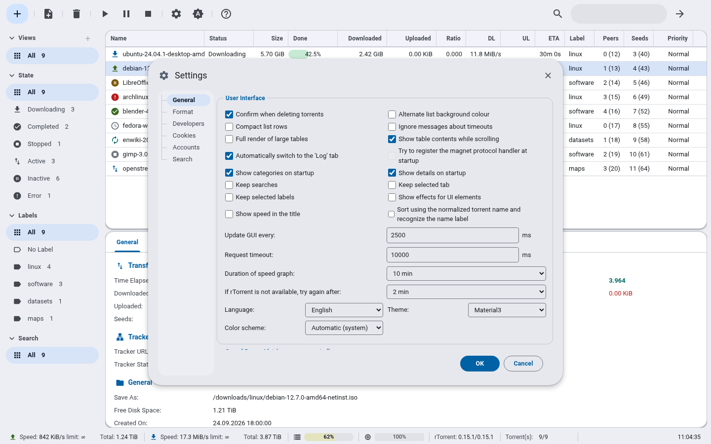 | 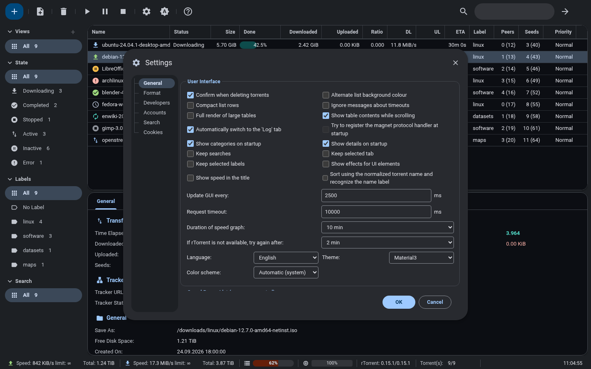 |
| 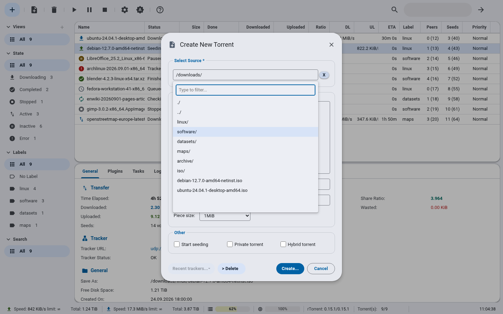 | 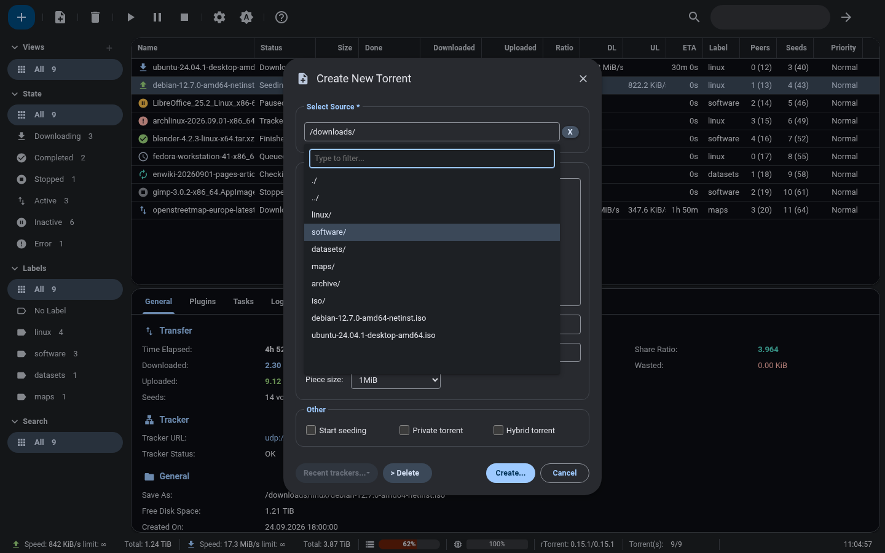 |

| Mobile, light | Mobile menu, light | Mobile, dark | Mobile menu, dark |
|---|---|---|---|
| 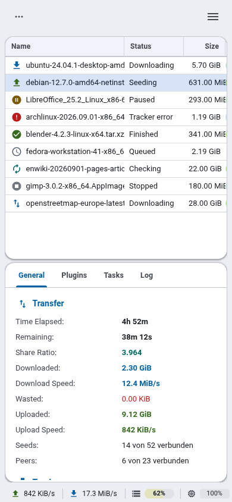 | 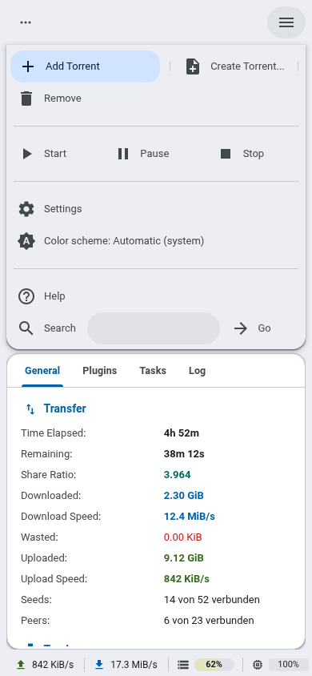 | 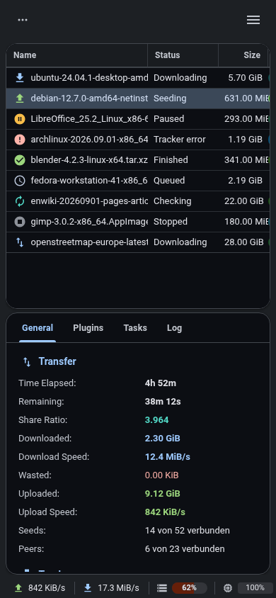 | 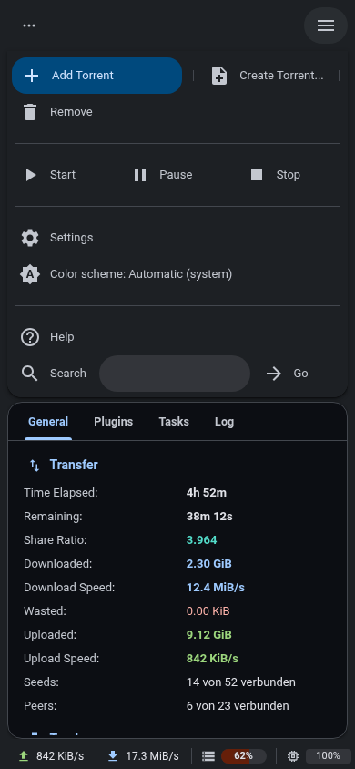 |

The screenshots use sample data. Torrent names, labels, speeds and directory names are made up.

## Requirements

- ruTorrent 5.x with the bundled `theme` plugin enabled. Developed and tested against ruTorrent 5.3.15.
- A current browser. The theme relies on CSS `color-mix()`, `:has()`, `mask-image` and `::part()` (Chrome/Edge 111+, Firefox 121+, Safari 16.4+).

## Installation

1. Put the theme into `plugins/theme/themes/Material3` in your ruTorrent installation. The folder must be named `Material3`, because ruTorrent shows the folder name in the theme list.

   **From a release (recommended):** download `Material3-<version>.zip` from the [latest release](../../releases/latest) and unpack it into `plugins/theme/themes/`. The archive already contains the `Material3` folder:

   ```sh
   cd /path/to/rutorrent/plugins/theme/themes
   unzip /path/to/Material3-<version>.zip
   ```

   **From git**, to update later with `git pull`:

   ```sh
   cd /path/to/rutorrent/plugins/theme/themes
   git clone <repository-url> Material3
   ```

2. Pick the theme in ruTorrent under **Settings → General → Theme → Material3** and confirm with OK. ruTorrent reloads with the new theme.

   To make it the default for all users, set it in `plugins/theme/conf.php`:

   ```php
   $defaultTheme = "Material3";
   ```

3. After an update, reload the page with the browser cache bypassed (Ctrl+Shift+R / Cmd+Shift+R). ruTorrent loads the theme files with a fixed version parameter, so browsers may keep the old ones.

To update from a release, delete the old `Material3` folder first and unpack the new archive in its place, so no files from the old version are left behind.

## Configuration

### Color scheme

Every user can pick **Automatic (system)**, **Light** or **Dark** in two places:

- **Settings → General → Color scheme**, next to the theme select.
- The **toolbar button** right of the settings button. Each click moves to the next choice (Automatic → Light → Dark), and the icon shows the current one.

The choice is stored in the user's ruTorrent settings on the server (`webui.md3.scheme`), so it follows the user to other browsers and devices. A copy in the browser's localStorage makes the first paint use the right scheme before the settings have arrived.

For users who have not picked a scheme yet, the default is set at the top of `init.js`:

```js
// 'auto' follows the operating system setting, 'light' or 'dark' force a scheme.
plugin.md3Scheme = 'auto';
```

The labels are available in English, German, French, Spanish, Italian, Dutch, Polish and Russian, and follow the ruTorrent language. Other languages fall back to English.

### Custom colors

All colors are Material 3 tokens (`--md-primary`, `--md-surface-container`, …) at the top of `style.css`. There is one block for the light scheme (`:root`) and one for the dark scheme (`:root[data-md-scheme="dark"]`). A generator such as the [Material Theme Builder](https://material-foundation.github.io/material-theme-builder/) exports matching values.

A few colors are also computed in JavaScript. Mirror your new values there as well:

- `init.js`, `plugin.md3Palettes`: progress bars, disk and CPU meters, speed graph. These values must be hex (`#rrggbb`), because ruTorrent's color parser does not understand `var()`, `hsl()` or `rgba()`.
- `style.css`: the colored inline SVGs (`--md-img-*`: sort arrow, menu checkmark, spinner). Their fill color is written as `%23rrggbb`.

## Files

| File | Purpose |
|---|---|
| `style.css` | Design tokens, fonts, icons and all core UI components |
| `stable.css` | Tables: header, rows, progress bars, status and file icons |
| `plugins.css` | Overrides for plugin styles. It loads after all plugin stylesheets. |
| `init.js` | Color scheme setting and toolbar button, JavaScript-computed colors, directory browser positioning |
| `font/` | Roboto 400/700 (woff2, several subsets) |
| `screenshots/` | Images used in this README (not included in release archives) |

## Releasing

Pushing a version tag builds `Material3-<tag>.zip` and publishes a GitHub release with it (`.github/workflows/release.yml`):

```sh
git tag v1.0.0
git push origin v1.0.0
```

The archive unpacks to a `Material3` folder. Everything marked `export-ignore` in `.gitattributes` (screenshots and repository files) is left out. To build the same archive locally:

```sh
git archive --format=zip --prefix=Material3/ -o Material3-v1.0.0.zip v1.0.0
```

## Known limitations

- Dialogs are limited to 95% of the window height by ruTorrent itself. In a very low window, for example with docked developer tools, the content area of a dialog shrinks and scrolls.
- Plugins that are not listed under Features use their own images and colors, which may not match the theme.

## License

Copyright (C) 2026 Material3 theme contributors

This theme is free software: you can redistribute it and/or modify it under the terms of the [GNU General Public License](LICENSE) as published by the Free Software Foundation, either version 3 of the License, or (at your option) any later version. That is the same license as ruTorrent itself.

### Third-party assets

- Icons: [Material Icons](https://github.com/google/material-design-icons) by Google, Apache License 2.0
- Font: [Roboto](https://github.com/googlefonts/roboto) by Google, SIL Open Font License 1.1

See [`THIRD-PARTY-NOTICES.md`](THIRD-PARTY-NOTICES.md) for details.
